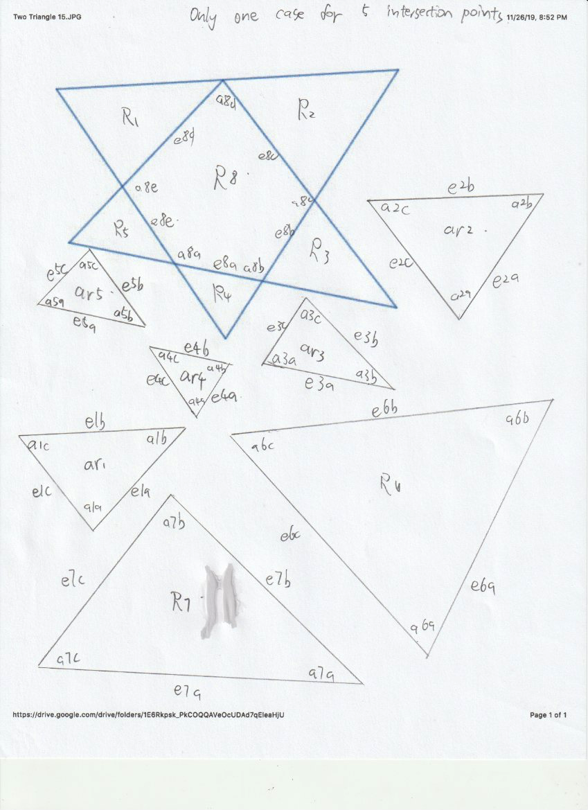

# EECS 118 Term Project part 1: Geometry Solver
## Author & Contact
#### Ceyu Xu
* Email: ceyux@uci.edu
* Student ID: 30122153
#### Yunhe Shao
* Email: yunhes@uci.edu
* Student ID: 42243255

## Functionalities
- [x] Infer Parallels
- [x] Infer Equals
- [x] Infer Perpendiculars
- [x] Infer Sum
- [x] Infer Fraction
- [ ] Infer Tangent (It is impossible to have a tangent in our graph)
- [x] Infer Similar
- [x] **Supports Numbers of Inputs more than 3**
- [x] **Additional Feature: Infer exact value of angles and edges if possible (By calling `solver.display_angle_edge()`)**

## Graph of Namings

## Naming Rules:
* Edge start with "e"
* Angle start with "a"
* The digit in the middle represents which triangle it belongs to

## Test Cases
### Simplest one
#### Code (Refer to "tb0.py"")
```python
import solver
print(solver.get_all())
```
#### Output
```python
{'parallel': [], 'perpendicular': [], 'equal': [], 'fraction': [], 'sum': [], 'similar': []}
```

### A Standard One
#### Code (Refer to "tb1.py")
```python
import solver
solver.set_parallel('e6b', 'e7a') # Set e6b and e7a parallel
print(solver.get_all())
```
#### Output 
```python
{'parallel': [['e5a', 'e1b', 'e6b', 'e3a', 'e7a', 'e4b', 'e2b', 'e8a']], 'perpendicular': [], 'equal': [], 'fraction': [], 'sum': [], 'similar': [['ar1', 'ar5'], ['ar2', 'ar3']]}
```
#### Explanation
* The parallelism of the e6b and e7a caused other small edges also to be parallel
* The parallelism also causes two pairs of triangles to be similar

### A More Complicated One
#### Code (Refer to "tb2.py")
```python
import solver

solver.set_perpendicular('e6b', 'e6c')
solver.set_perpendicular('e6c', 'e7a')

solver.set_equal('a6a', 'a5b')

print(solver.get_all())
```
#### Output 
```python
{'parallel': [['e6b', 'e6c'], ['e6b', 'e5a', 'e8a', 'e1b', 'e2b', 'e3a', 'e4b', 'e7a'], ['e6b', 'e6c']], 
 'perpendicular': [['e5a', 'e7a'], ['e7a', 'e8a'], ['e1b', 'e7a'], ['e2b', 'e7a'], ['e3a', 'e7a'], ['e4b', 'e7a'], 
                  ['e7a', 'e7a'], ['e6b', 'e6b'], ['e5a', 'e6b'], ['e6b', 'e8a'], ['e1b', 'e6b'], ['e2b', 'e6b'], 
                  ['e3a', 'e6b'], ['e4b', 'e6b'], ['e7a', 'e8e'], ['e4c', 'e7a'], ['e1c', 'e7a'], ['e6b', 'e6c'], 
                  ['e5a', 'e6c'], ['e6c', 'e8a'], ['e1b', 'e6c'], ['e2b', 'e6c'], ['e3a', 'e6c'], ['e4b', 'e6c']], 
 'equal': [['a4a', 'a5b'], ['a4c', 'a6a']], 
 'fraction': [], 
 'sum': [['a6a', 'a8a', 180]], 
 'similar': [['ar1', 'ar5'], ['ar2', 'ar3']]}
```
#### Explanation
* e6b perpendicular to e6c; e6c perpendicular to e7a; Thus, e6b parallel to e7a
* Thus, many other sub-edges are parallel due to e6b parallel to e7a (Refer to the graph, you will understand this)
* Then, the parallelism of e6b and e7a causes the two pairs of triangles to be similar
* Also, more perpendiculars are infered based on the inputs
* Finally, because of the euqality inputed and infered, we infered a relationship about the SUM of a6a and a8a

### A Very Complicated Example
#### Code (Refer to "tb3.py")
```python
import solver

solver.set_equal('a6c', 'a6a')
solver.set_equal('a4a', 'a4b')
solver.set_parallel('e6b', 'e7a')
solver.set_fraction('a6c', 'a2a', 0.5)
solver.set_sum_value('a4b', 'a4c', 2)
solver.set_perpendicular('e2b', 'e2c')

print(solver.get_all())

```
#### Output 
```python
{'parallel': [['e1b', 'e8a', 'e6b', 'e3a', 'e5a', 'e2b', 'e7a', 'e4b']], 
 'perpendicular': [['e1b', 'e2c'], ['e2c', 'e8a'], ['e2c', 'e6b'], ['e2c', 'e3a'], ['e2c', 'e5a'], ['e2c', 'e7a'],
                   ['e2c', 'e4b']], 'equal': [['a1c', 'a6a'], ['a4a', 'a6c'], ['a6a', 'a4b'], ['a3a', 'a4a']], 
 'fraction': [['a1c', 'a2a', 0], ['a6c', 'a3c', 0], ['a6a', 'a2a', 0]], 
 'sum': [['a4a', 'a8b', 180], ['a4b', 'a5b', 2], ['a3a', 'a4c', 2], ['a4a', 'a4c', 2]], 
 'similar': [['ar1', 'ar5'], ['ar2', 'ar3']]}

```
#### Explanation
* At this level of complexity, I can't understand how it infers so many solutions, but the result seems correct

